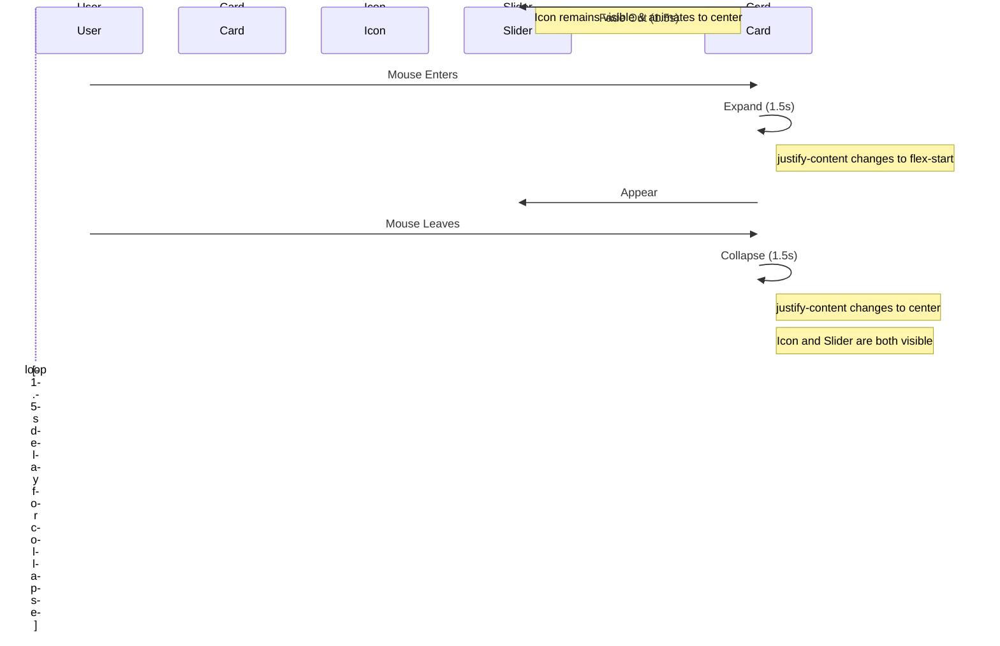

# Gridable - Style Guide

## Directive

The entire application layout, from the main page structure down to the individual components, will be managed using CSS Grid. Vuetify components should be used for UI elements (like buttons, inputs, etc.), but not for layout.

This document outlines the style guide for the Gridable application. It is based on Vuetify.

## Layout

- The application uses a CSS:Grid-based layout philosophy.
- The main layout is defined in `assets/css/layouts/main.css` and `layouts/default.vue`.
- [ ] The layout should be responsive and work well on different screen sizes.

## UI Component Spaces

This section defines the named grid areas for the main UI components. These areas are defined in `layouts/default.vue`.

### [ ] Navigation Drawer

*   **CSS Grid Area Name:** `nav-drawer`
*   **Description:** A collapsible, resizable vertical panel on the left side of the screen that serves as the primary navigation for the application.
*   **Structure:**
    *   **Navigation List:** A `v-list` component (`.nav-list`) that contains all navigation links, including nested groups for documentation.
    *   **Resizer:** A draggable element (`.resizer`) on the right edge that allows the user to dynamically adjust the width of the drawer.
*   **Behavior:**
    *   **Collapsible:** The drawer's visibility can be toggled by the user.
    *   **Resizable & Persistent:** The width can be adjusted by dragging the resizer. The width is managed by the `--nav-drawer-width` CSS custom property and its value is automatically saved to the user's OrbitDB preferences via the `userPreferences` service. This ensures the user's chosen width persists across sessions. The default width is `256px`, with a minimum of `180px` and a maximum of `600px`.

### [ ] Application Bar

*   **CSS Grid Area Name:** `app-bar`
*   **Description:** The main header bar that spans the top of the application. It contains navigation controls, branding, and user-specific components.
*   **Structure:**
    *   **Navigation Toggle:** A `v-app-bar-nav-icon` that toggles the visibility of the Navigation Drawer.
    *   **Brand Image:** An `v-img` element (`.brand-logo`) displaying the Gridable brand mark.
    *   **Theme Toggle:** The `ThemeToggle` component, allowing users to switch between light and dark modes.
    *   **User Authentication:**
        *   `UserProfileChip`: Displays the current user's profile information if authenticated.
        *   `LoginButton`: Displayed for unauthenticated users to initiate login.
*   **Behavior:**
    *   **Sticky:** The app bar remains fixed at the top of the viewport as the user scrolls the main content.

### [ ] Main Content

*   **CSS Grid Area Name:** `main-content`
*   **Description:** The primary content area of the application. It dynamically displays the content of the currently active page or view.
*   **Structure:**
    *   It contains a single `<slot />` element, which is populated by Nuxt's router with the component for the current route.
*   **Behavior:**
    *   **Scrollable:** The `main-content` area has `overflow-y: auto`, allowing its content to scroll vertically independently of the rest of the layout.

## [ ] Theming

- The application uses Vuetify for Material Design components.
- [ ] A theming system should be implemented to allow for easy customization of the application's look and feel.
- [ ] The theming system should be based on Vuetify's theming capabilities.
## Component-Specific Animations

### MarkdownViewer Font-Size Slider

The font-size slider control in the `MarkdownViewer` component features a complex, multi-stage animation sequence to provide a polished user experience while remaining unobtrusive.

**States:**

1.  **Active (Hover):** The control is fully expanded, showing the "Tt" icon and the `v-slider`.
2.  **Ready (Collapsed):** The control is collapsed, showing only the "Tt" icon, centered.
3.  **Dormant:** After 5 seconds of inactivity, the control shrinks and moves into the top-right corner to minimize its presence.

**Animation Principles:**

-   **Performance:** Animations should prioritize the GPU-accelerated `transform` and `opacity` properties over layout-affecting properties like `margin` or `width` to ensure smoothness and prevent "jerkiness".
-   **Clarity:** The animation sequence should be sequential and clearly communicate the state change to the user.

**Implementation via Sequential Animation (Final Plan):**

The animation is controlled by pure CSS transitions, driven by state changes in the Vue script. This is the most robust and maintainable approach.

**Key Implementation Details (Final):**

-   **Principle:** The animation will be controlled by pure CSS transitions, driven by state changes in the Vue script. This is the most robust and maintainable approach. All programmatic animation (`requestAnimationFrame`) will be removed.
-   **Icon Positioning:** The icon's position is determined *naturally* by the parent's `justify-content` property (`flex-start` when active, `center` when inactive).
-   **The Animation:** A simple CSS `transition` will be applied to the icon itself. This allows the browser to smoothly animate the change in the icon's position when the parent's layout changes, eliminating all "jerks" and race conditions.

### Anatomy of the Font-Size Slider

This table details the structure, styling, and state management for each of the component's three primary modes.

| Feature | Expanded (Active) | Readiness (Collapsed) | Dormant |
| :--- | :--- | :--- | :--- |
| **Trigger** | Mouse enters `.slider-container` | Mouse leaves `.slider-container` | 5-second inactivity timer (`resetInactivityTimer`) |
| **Key State** | `isHovering = true` | `isHovering = false` | `isDormant = true` |
| **Appearance** | - Card is `400px` wide. - `v-slider` is visible (`isSliderVisible = true`). - Icon is offset to the left. | - Card is `72px` wide. - `v-slider` is hidden. - Icon is centered. | - Card is scaled to 50% and moved to the top-right corner. |
| **Key CSS** | `.slider-card.is-active` | `.slider-card` (default state) | `.slider-card.is-dormant` |
| **Behavior** | Allows user to change `fontSize`. Icon is positioned to the left to make space for the slider. | The default, resting state of the control. Awaits user interaction. | A low-profile state to avoid distracting the user when they are not interacting with the control. |